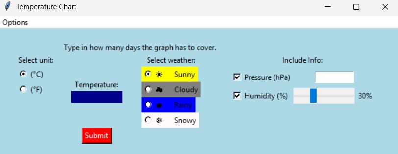
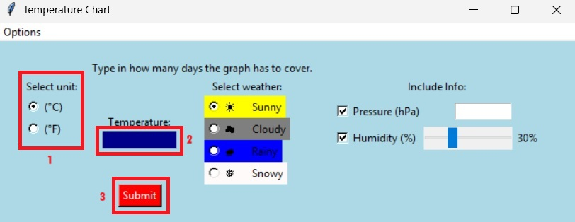
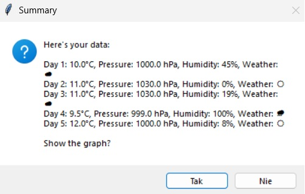
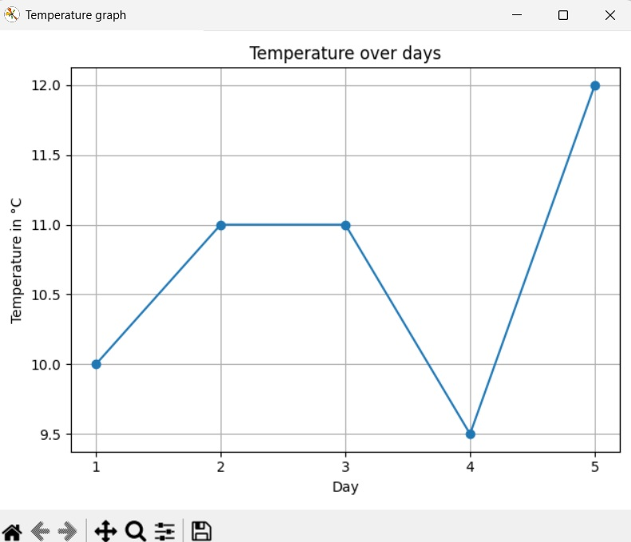
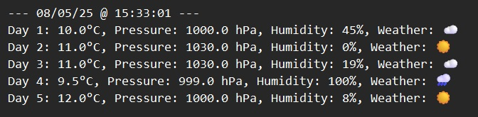

# Alogi's Temperature app

  
  

> Alogi's Temperature app, for those who want to put their temperature readings on a graph!
 

  

## Features:

- **Intuitive GUI:** Simple and clean interface built with Tkinter.
- **Multi-Data Input:** Track temperature, weather conditions, atmospheric pressure, and humidity.
- **Optional Fields:** Use checkboxes to include or exclude pressure and humidity on a per-day basis.
- **Interactive Humidity Slider:** An easy-to-use slider with a live percentage display.
- **Data Summary:** View a full summary of your data before plotting.
- **Export to File:** Save your session data to a `Temperature_info.txt` file with a timestamp.

## Instruction:

### 1. select the unit for temperature (*C/*F), then type in the dark blue window how many days you want the graph to show, then click "submit"

  

### 2. type in the temperature readings for each day and for the additional info if you want to

### 3. when you input the readings for all the days, a confirmation of your info and a short summary will appear

  

### 4. the graph with your info will appear on the screen as a new window. You can interact with the graph 

> (NOTE: In the version 1.4 the graph only shows the temperature.)

  

### 5. when you are done with the graph, close the window and a message box will appear asking if you want the summary of the info to be saved to a Temperature_info.txt file. 

> If yes, the data will be saved in the .txt format with the current date and time

  

> If not, you can go on with your life, and share the app to your friends

# Enjoy the app! 
